## 1.	全国开发区现代远程与继续教育公共服务平台

[国家中小企业信息化公共服务平台](niis.org.cn)

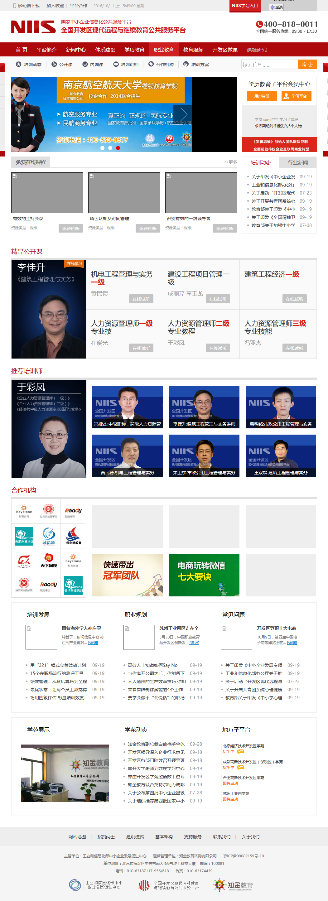

## 2.	Mirosoft China Service Provider License Agreement

www.chinaspla.com  
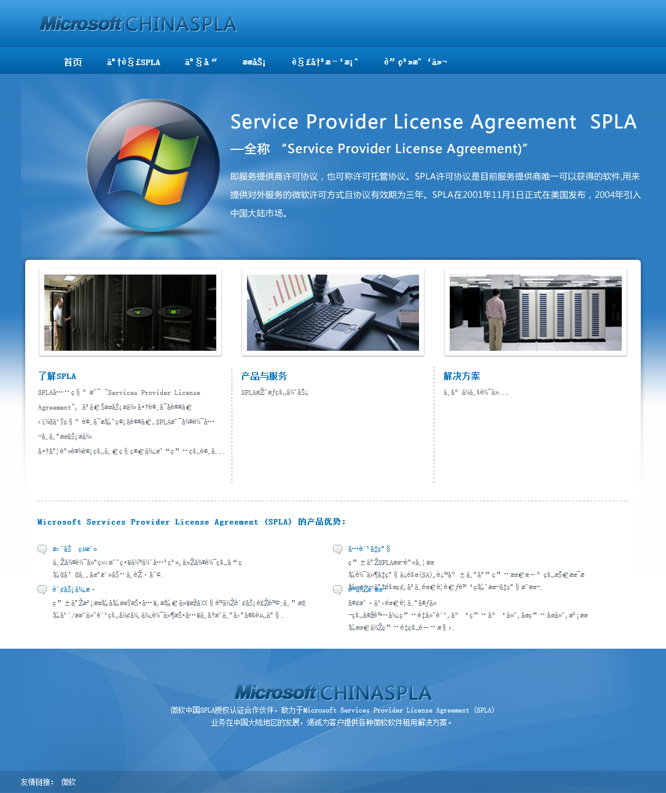

## 3.	随身学移动课堂
www.edu68.net	

## 4.	全国高等院校计算机基础教育研究会高职高专专业委员会

www.m-internet.com

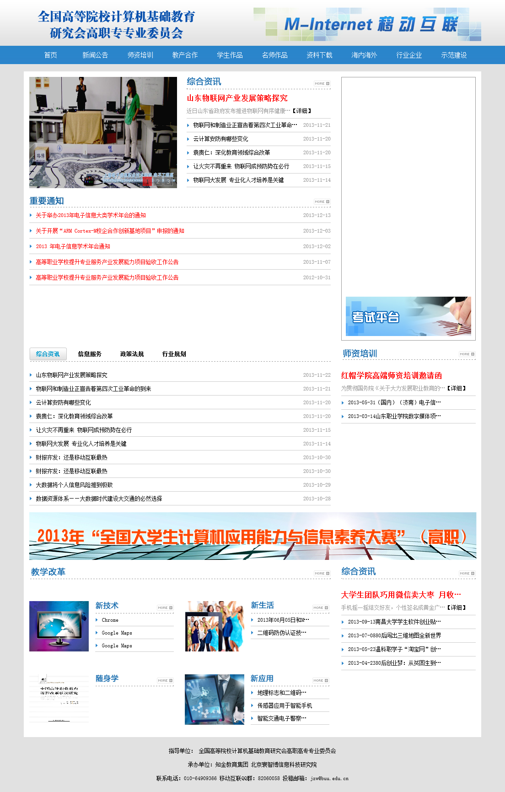

## 5.	北京市信息管理学校	

主网、社区培训部、金融事务系、现代服务系、招生就业、德育实践、媒体艺术系、数码技术系、教学园地
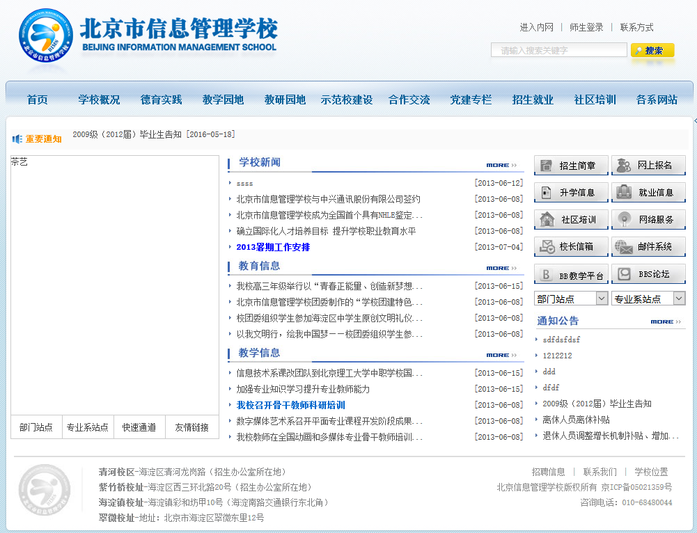

## 8.	北京北外附属外国语学校

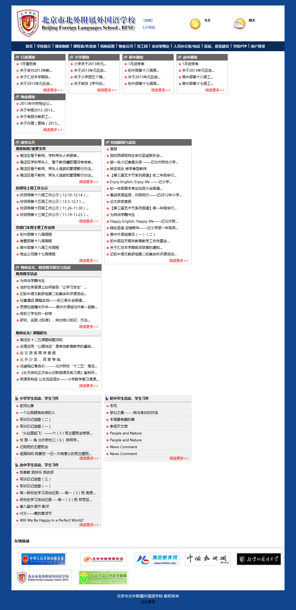

## 10.	北京市城市建设学校外网

北京市城市建设学校外网
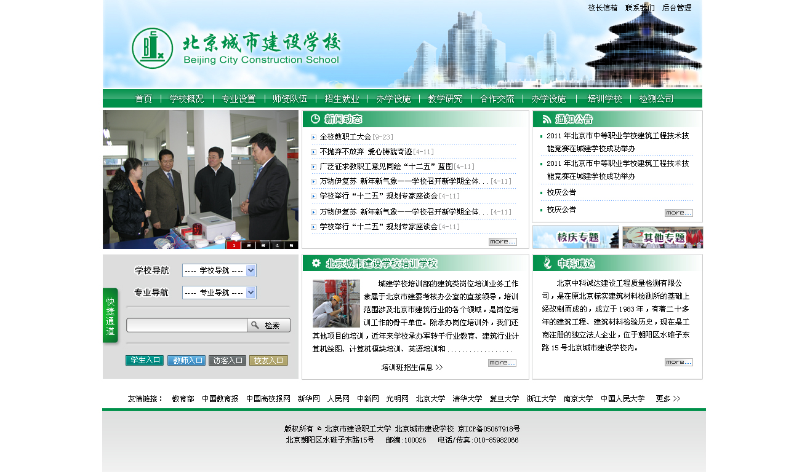

北京城市建设学校培训学校
* 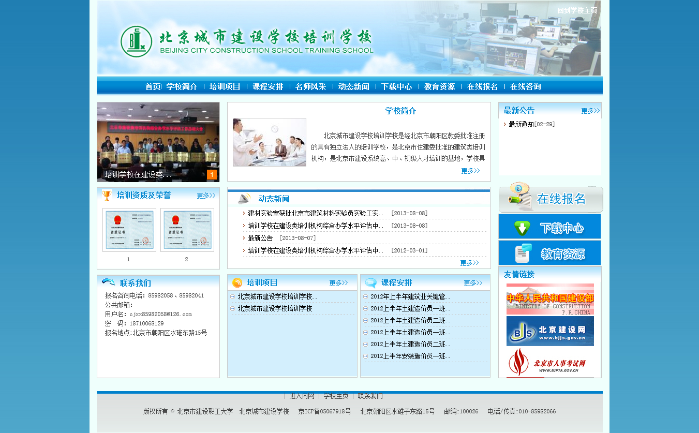

## 15.	北京财贸职业学院-物流专业职业教育分级网站

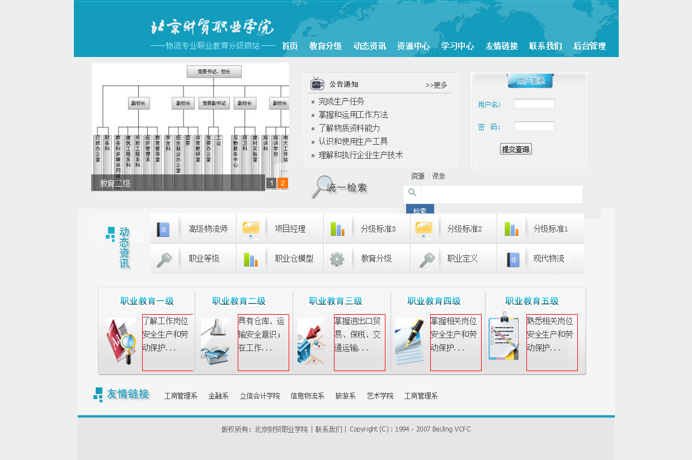

## 16.	上海东皇文化传播-高招咨询网

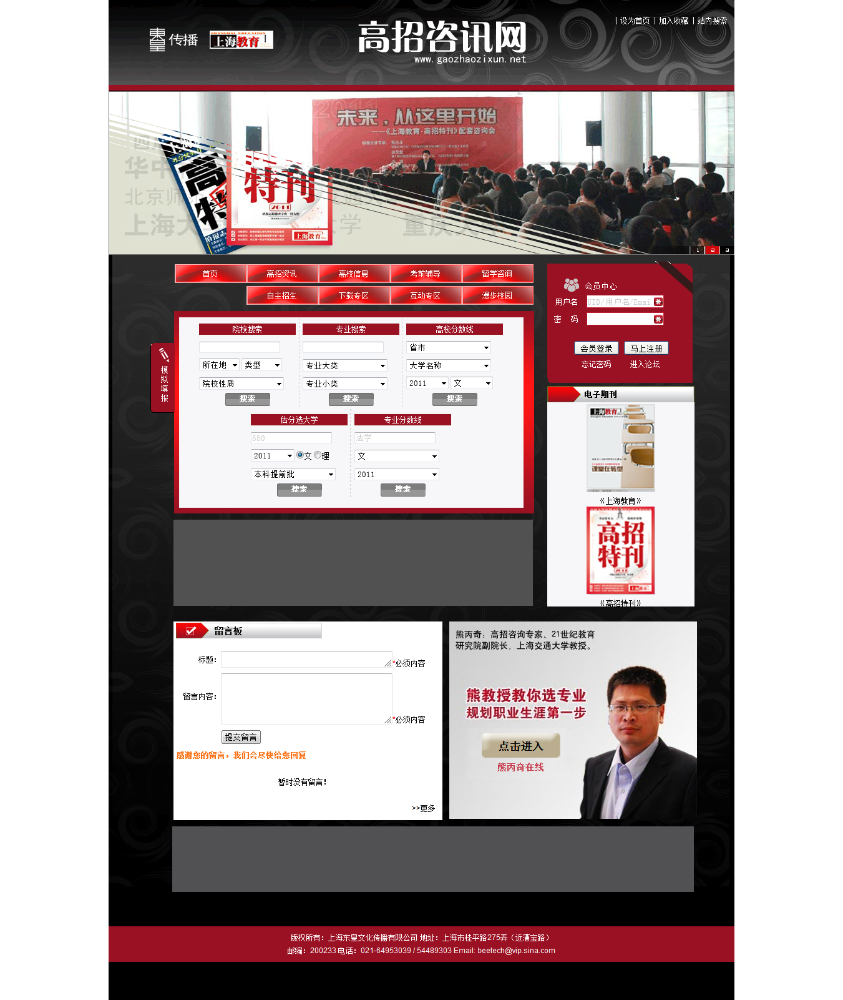

电子书阅读器
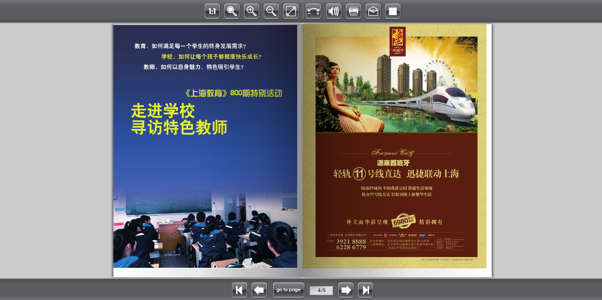

## 17.	知金教育-总部官网（旧版、新版）

## 18.	知金教育-航空项目营销网站

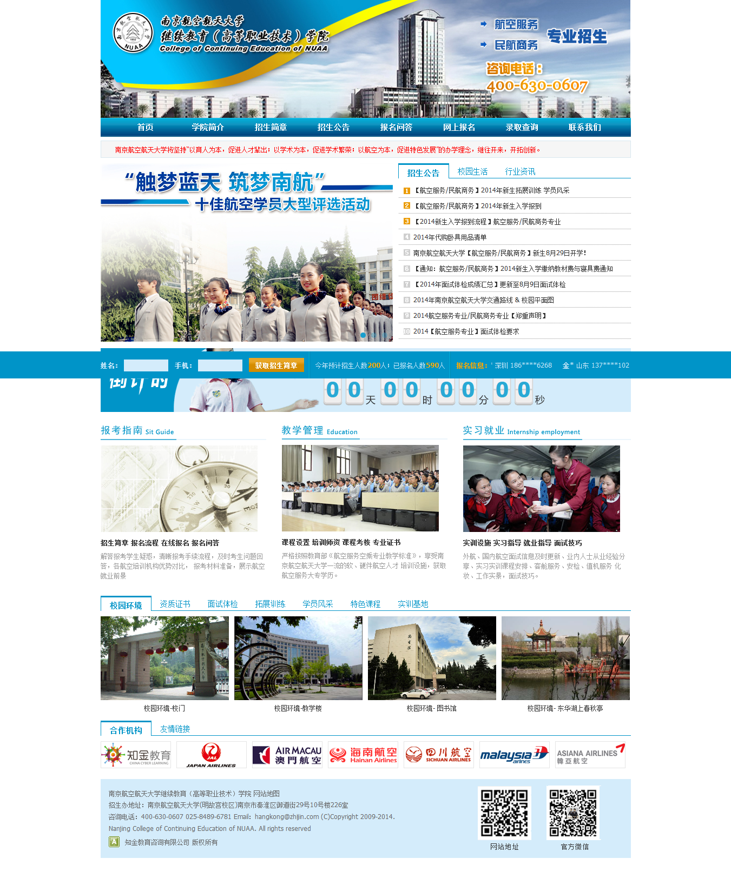

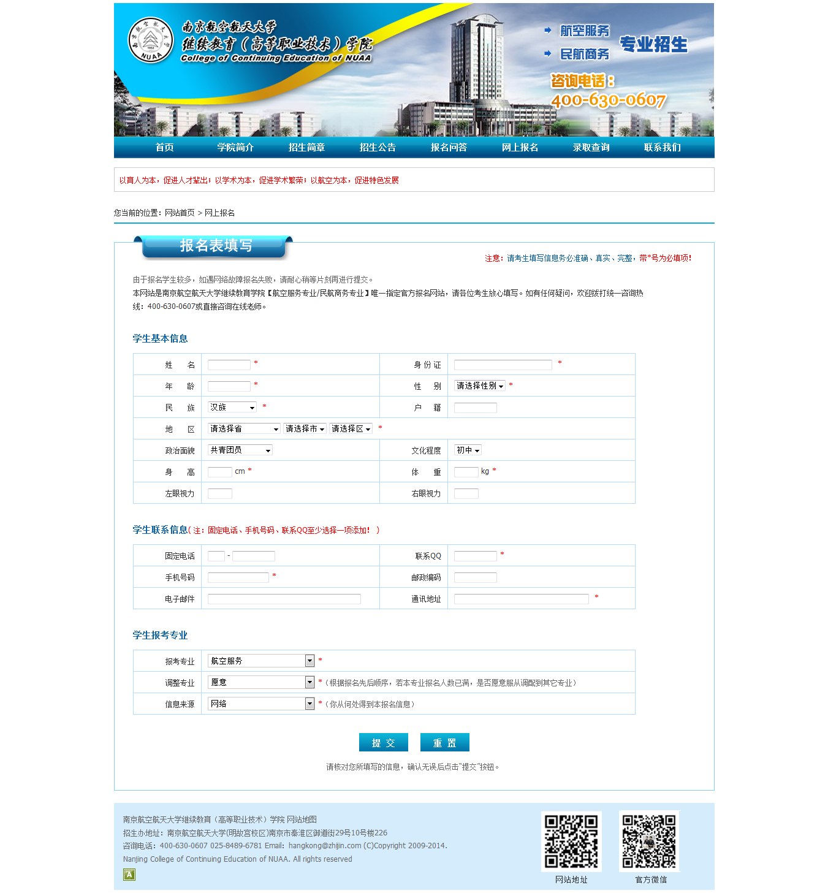

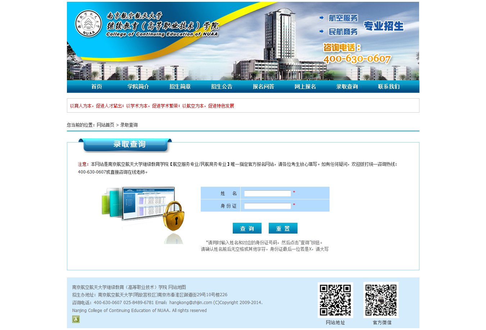

## 19.	知金教育网站群

成都学苑、亦庄学苑

### 奥根航空
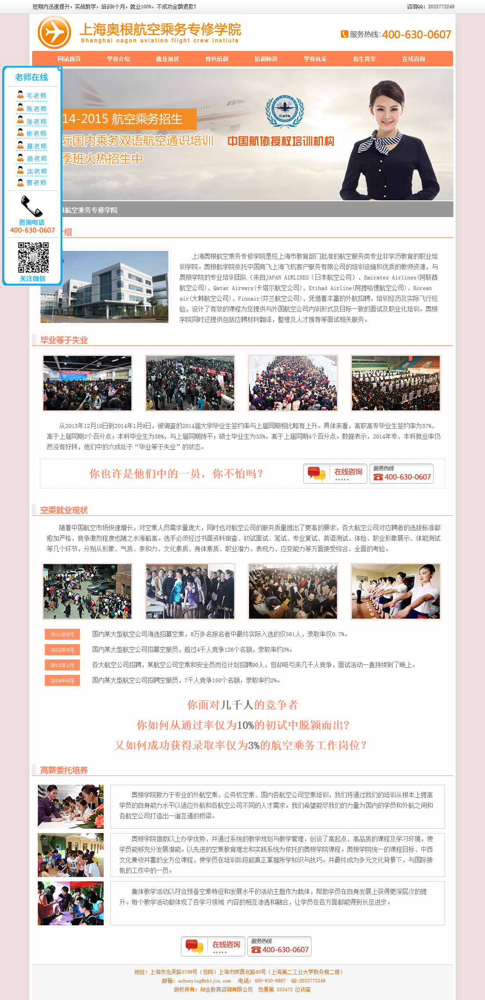

### 牛M王

### 美式整脊随身学
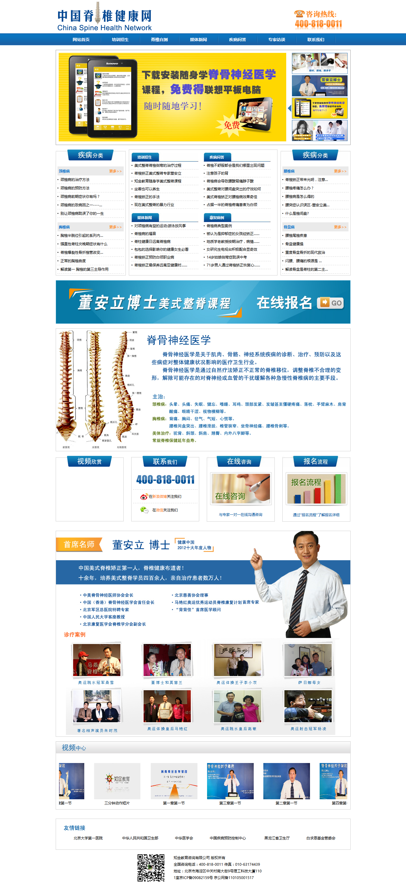
